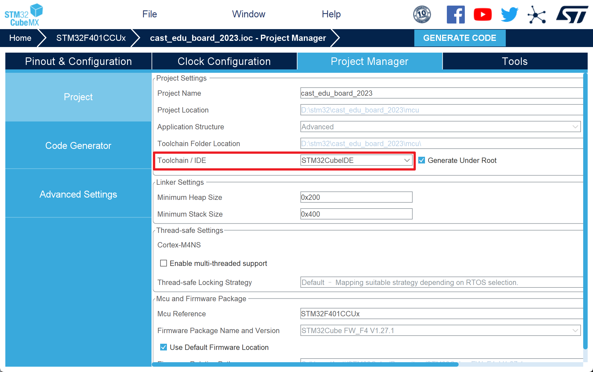
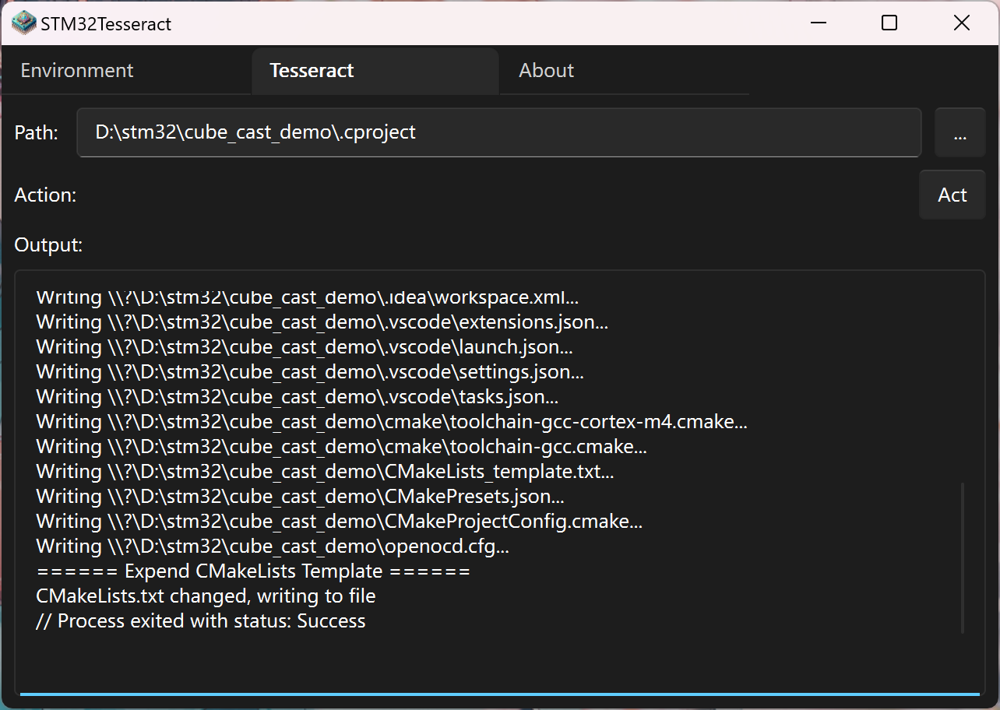
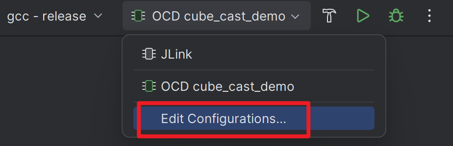
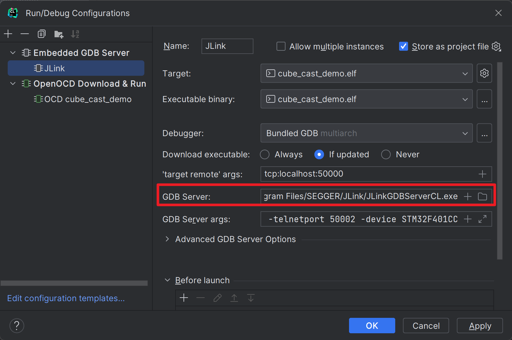

# STM32Tesseract Tutorial
## Setting Up the Build Environment
1. Launch `stm32tesseract-gui`.
2. Navigate to the `Environment` tab.
3. Click `Up` to initiate the build environment setup.
4. The program will automatically download the necessary toolchain and configure the environment variables.
5. ***Restart your computer to activate the new environment variables.***

_Note: Administrator privileges may be required._

## Generating a Project
1. Create a project using STM32CubeMX.
2. Navigate to `Project Manager > Project > Project Settings > Toolchain / IDE > STM32CubeIDE`.  
   
3. Generate the code with STM32CubeMX.
4. Open `stm32tesseract-gui`.
5. Switch to the `Tesseract` tab.
6. Choose the `.cproject` file.
7. Click `Act` to initiate project generation.  
   
8. The CMake project, along with configurations for VSCode and CLion, will be created in the same directory as the `.cproject` file.

## Using the Generated Project
### VSCode
#### Building the Project
1. Open the project directory in VSCode.
2. Install any recommended extensions.
3. Open the command palette and execute `CMake: Select Configure Preset`, then select an option (e.g., `gcc`).
4. Open the command palette again and execute `CMake: Select Build Preset`, then select an option (e.g., `MinSizeRel`).
5. Execute `CMake: Build` (or press F7) to build the project.

#### Running the Project
1. Open the command palette and execute `Tasks: Run Task`.
2. Choose `Download (OpenOCD)` to upload the program to the board.
3. If you're using ST-Link instead of CMSIS-DAP, modify the configuration in `openocd.cfg`.

_Reminders:_
- **Refrain from using the launch button on CMake Tools' status bar due to potential issues.**

#### Debugging
1. Open the Run and Debug Panel.
2. Select either `Debug (OpenOCD)` or `Debug (JLink)`.
3. For users of ST-Link, modify the configuration in `openocd.cfg`.
4. JLink users should define the JLink GDB Server path in `launch.json`.

_Reminders:_
- **Refrain from using the debug button on CMake Tools' status bar due to potential issues.**
- SVD files for command devices are pre-configured. Peripheral registers can be viewed in the Run and Debug panel.

### CLion
#### Initial Setup
For first-time users of CLion:

1. Access `File > Settings` or use the shortcut `Ctrl + Alt + S`.
2. Go to `Build, Execution, Deployment > Embedded Development`.
3. Define the paths for the OpenOCD executable and STM32CubeMX executable.  
   
4. Click `Apply` and then `OK`.

#### Building the Project
1. Open the project directory in CLion.
2. Click `Build` or press `Ctrl + F9`.

#### Running the Project
1. Choose Run Configurations: `OCD {project-name}`.
2. Click `Run` or press `Shift + F10`.
3. ST-Link users should modify the configuration in `openocd.cfg`.

#### Debugging
1. Select Run Configurations: `OCD {project-name}` or `JLink`.
2. Click `Debug` or press `Shift + F9`.
3. ST-Link users should adjust the configuration in `openocd.cfg`.
4. JLink users must specify the JLink GDB Server path by editing Run Configurations.  
     
   

_Note: CLion does not automatically configure SVD files. Manually download and load the SVD file for peripheral register viewing._

## Configuring OpenOCD
The default OpenOCD configuration is set for CMSIS-DAP. ST-Link users need to modify `openocd.cfg`.

Replace:
```cfg
source [find interface/cmsis-dap.cfg] # CMSIS-DAP
```
With one of the following, depending on your ST-Link version:
```cfg
source [find interface/stlink.cfg] # ST-Link V1
source [find interface/stlink-v2.cfg] # ST-Link V2
source [find interface/stlink-v3.cfg] # ST-Link V3
```

## Choosing a Build Preset
Available build presets:

- `Debug`: For debugging.
- `Release`: Optimized for speed, no debug information.
- `MinSizeRel`: Optimized for smaller size.
- `RelWithDebInfo`: Optimized release with debug information.

For instance, select `MinSizeRel` to reduce program size or `Debug`/`RelWithDebInfo` for debugging purposes.